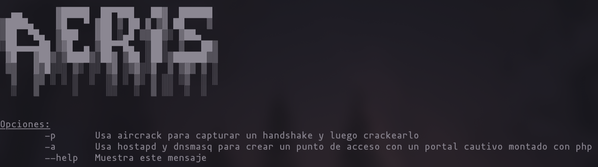

<div align="center">

# AERIS

Software desarrollado en Bash para auditorías de seguridad en redes WiFi.



</div>

## Modos

Implementa dos modos principales de operación:

### Auditoría WPA/WPA2

- Escaneo de redes disponibles
- Captura de handshake WPA/WPA2
- Envío de paquetes de desautenticación
- Ataque por diccionario

Dependencias:
```
aircrack-ng
```

### Rogue Access Point + Portal Cautivo

- Creación de punto de acceso configurable, con WPA2 opcional
- Configuración automática de DHCP
- Portal cautivo basado en PHP con captura de credenciales
- Plantillas disponibles:
    - Google
    - Apple
    - Instagram

Dependencias:
```
hostapd
dnsmasq
php
```
Las credenciales capturadas se almacenan en:
```creds.txt```

## Uso
- Instalacion
```bash
git clone https://github.com/vid4l-07/Aeris.git
```

- Mostrar ayuda
```bash
sudo ./aeris.sh --help
```

- Rogue AP con Portal Cautivo
```bash
sudo ./aeris.sh -a
```

- Captura y Crackeo de handshake WPA/WPA2
```bash
sudo ./aeris.sh -p
```

## Estructura del Proyecto
```
aeris/
│
├── aeris.sh          # Script principal
├── src/ 
│   ├── ap.sh             # Lógica del Access Point y portal cautivo
│   ├── reset.sh          # Restauración de interfaz
│   └── wifipass.sh       # Captura y crackeo de WPA/WPA2
├── pages/            # Plantillas del portal cautivo 
│   ├── google/
│   ├── apple/
│   └── instagram/
└── utils/            # Scripts auxiliares

```

## Limpieza y Restauración

Al finalizar o interrumpir el proceso:
- Se eliminan directorios temporales (content/, data/)
- Se restauran las interfaces de red
- Se detienen procesos asociados
- Se ejecuta reset.sh para devolver la interfaz a estado normal

---

### Advertencia Legal

Este software está destinado exclusivamente a:
- Auditorías autorizadas
- Formación académica
- El autor no asume responsabilidad por el uso indebido del software.
