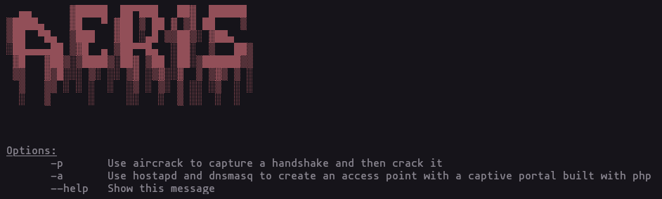

<div align="center">

# AERIS

Bash script for security audits on WiFi networks.



</div>

## Modes

It implements two main operating modes:

### WPA/WPA2 Audit

- Scanning of available networks
- WPA/WPA2 handshake capture
- Sending deauthentication packets
- Dictionary attack

Dependencies:
```
aircrack-ng
```

### Rogue Access Point + Captive Portal

- Creation of a configurable access point, with optional WPA2
- Automatic DHCP configuration
- PHP-based captive portal with credential capture
- Available templates:
    - Google
    - Apple
    - Instagram

Dependencies:
```
hostapd
dnsmasq
php
```
Captured credentials are stored in:
```creds.txt```

## Usage
- Installation
```bash
git clone https://github.com/vid4l-07/Aeris.git
```

- Show help
```bash
sudo ./aeris.sh --help
```

- Rogue AP with Captive Portal
```bash
sudo ./aeris.sh -a
```

- WPA/WPA2 handshake capture and cracking
```bash
sudo ./aeris.sh -p
```

## Project Structure
```
aeris/
│
├── aeris.sh          # Main script
├── src/ 
│   ├── ap.sh             # Access Point and captive portal logic
│   ├── reset.sh          # Interface restoration
│   └── wifipass.sh       # WPA/WPA2 capture and cracking
├── pages/            # Captive portal templates 
│   ├── google/
│   ├── apple/
│   └── instagram/
└── utils/            # Helper scripts

```

## Cleanup and Restoration

When finishing or interrupting the process:
- Temporary directories are removed (content/, data/)
- Network interfaces are restored
- Associated processes are stopped
- reset.sh is run to return the interface to its normal state

---

### Legal Warning

This software is intended exclusively for:
- Authorized audits
- Academic training
- The author assumes no responsibility for misuse of the software.